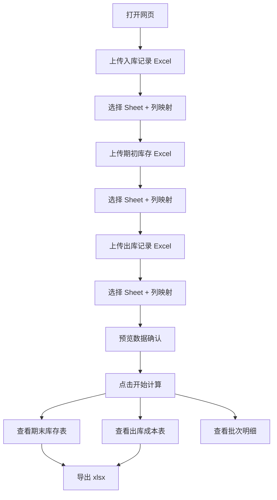

# 月度汇算 Web 版 - 产品需求文档 (PRD)

## 1. 产品概述

餐饮企业月度物料汇算工具的 Web 版本，基于 FIFO（先入先出法）计算期末库存和出库成本。用户在浏览器中上传 Excel 文件，选择 Sheet 并映射列，工具自动计算并将结果导出为新的 xlsx 文件。纯前端实现，无需后端服务。

* 解决财务/仓管人员手工计算效率低、易出错的问题

* 从桌面 tkinter 应用迁移为 Web 应用，降低部署成本，提升用户体验

## 2. 核心功能

### 2.1 功能模块

1. **数据输入页**：上传 Excel 文件、选择 Sheet、设置行范围、列映射、数据预览
2. **计算结果页**：期末库存表、出库成本表、批次明细、导出结果

### 2.2 页面详情

| 页面名称  | 模块名称   | 功能描述                                   |
| ----- | ------ | -------------------------------------- |
| 数据输入页 | 入库记录配置 | 上传文件、选择 Sheet、设置行范围、自动/手动列映射、数据预览与异常标注 |
| 数据输入页 | 期初库存配置 | 同上（必需列：物料名称、数量、单价）                     |
| 数据输入页 | 出库记录配置 | 同上（必需列：物料名称、数量）                        |
| 计算结果页 | 期末库存表  | 展示物料名称、数量、加权平均单价、金额，有警告的行标黄            |
| 计算结果页 | 出库成本表  | 展示物料名称、出库数量、加权平均单价、出库金额，有警告的行标黄        |
| 计算结果页 | 批次明细   | 选择物料查看批次队列：来源、日期、原始数量、消耗数量、剩余数量、单价     |
| 计算结果页 | 导出功能   | 导出为 xlsx 文件（含期末库存和出库成本两个 Sheet）        |

## 3. 核心流程

用户打开网页 → 分别为入库/期初/出库上传 Excel 文件 → 选择 Sheet → 自动匹配列名（支持手动调整）→ 预览数据确认无误 → 点击"开始计算" → 查看 FIFO 计算结果 → 导出 xlsx 文件

## 4. 界面设计

### 4.1 设计风格

* **主色调**：深蓝灰 (#1e293b) 作为主色，搭配翡翠绿 (#10b981) 作为强调色

* **背景**：浅灰白 (#f8fafc) 底色，卡片式布局带微妙阴影

* **字体**：正文使用系统字体栈，数字使用等宽字体 (tabular-nums)

* **布局**：左右分栏或 Tab 切换，表格为主的信息密度型布局

* **图标**：使用 lucide-react 图标库

* **风格**：专业财务工具感，干净利落，数据密度高但不拥挤

### 4.2 页面设计概览

| 页面名称  | 模块名称  | UI 元素                            |
| ----- | ----- | -------------------------------- |
| 数据输入页 | 文件上传区 | 拖拽上传区域 + 文件选择按钮，显示文件名和 Sheet 下拉框 |
| 数据输入页 | 行范围设置 | 标题行号和末尾行号输入框，实时显示数据行范围提示         |
| 数据输入页 | 列映射   | 每个必需列一个下拉选择框，自动匹配高亮显示            |
| 数据输入页 | 数据预览  | 表格展示映射后数据，异常行标红，底部显示统计和异常信息      |
| 计算结果页 | 期末库存表 | 表格 + 汇总行，警告行标黄                   |
| 计算结果页 | 出库成本表 | 表格 + 汇总行，警告行标黄                   |
| 计算结果页 | 批次明细  | 物料选择下拉框 + 批次表格 + 汇总信息            |
| 计算结果页 | 导出按钮  | 绿色主按钮，点击后下载 xlsx 文件              |

### 4.3 响应式设计

* 桌面优先设计，最小宽度 1024px

* 表格区域支持横向滚动

* Tab 切换适配窄屏

## 5. 数据模型

### 5.1 输入数据（3 个来源）

| 来源   | 必需列             | 说明                    |
| ---- | --------------- | --------------------- |
| 入库记录 | 进货日期、物料名称、数量、单价 | 按日期排序的入库流水，数量可能为负（退货） |
| 期初库存 | 物料名称、数量、单价      | 本月期初结存                |
| 出库记录 | 物料名称、数量         | 本月出库汇总                |

### 5.2 输出数据（2 个结果）

| 输出   | 列                 | 说明                     |
| ---- | ----------------- | ---------------------- |
| 期末库存 | 物料名称、数量、单价、金额     | FIFO 消耗后剩余库存，单价为加权平均单价 |
| 出库成本 | 物料名称、出库数量、单价、出库金额 | FIFO 消耗的加权平均出库单价       |

## 6. 关键业务规则

1. **FIFO 排序**：期初优先 → 入库按日期升序 → 同日按行号升序 → 日期为空排最后
2. **退货处理**：入库数量为负时从队尾扣减最近批次
3. **出库超库存**：按实际库存计算，不足部分单价记为 0，记录警告
4. **列映射**：自动匹配 aliases 中的精确名称，匹配失败需手动选择
5. **异常检测**：数量为负（全部来源）、日期为空（入库）、单价为 0（入库+期初）
6. **行范围**：支持设置标题行号和末尾行号，跳过标题前行和汇总尾行
7. **数值精度**：所有金额和单价保留 2 位小数（四舍五入）

