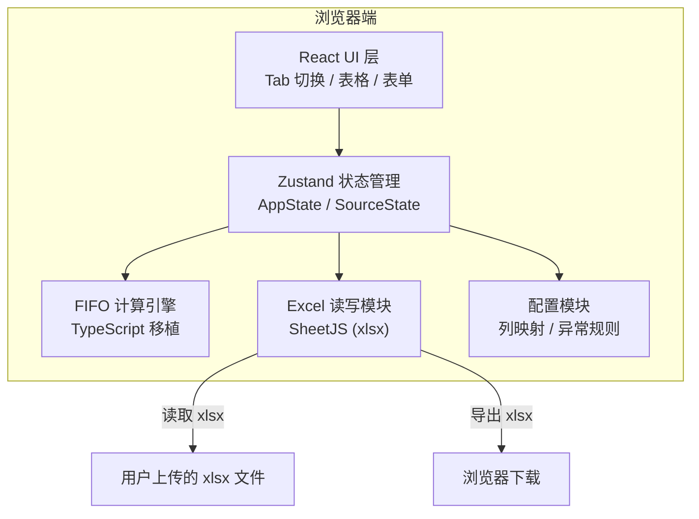

# 月度汇算 Web 版 - 技术架构文档

## 1. 架构设计

纯前端单页应用，所有计算逻辑在浏览器端完成，无需后端服务。



## 2. 技术说明

- **前端框架**：React 18 + TypeScript
- **构建工具**：Vite
- **样式方案**：Tailwind CSS 3
- **状态管理**：Zustand
- **Excel 读写**：SheetJS (xlsx) — 纯浏览器端解析和生成 xlsx
- **图标**：lucide-react
- **路由**：react-router-dom（单页 Tab 内切换，无多路由需求，仅用于根路径）
- **后端**：无
- **数据库**：无

## 3. 路由定义

| 路由 | 用途 |
|------|------|
| / | 应用主页面，包含数据输入和计算结果两个 Tab |

## 4. 项目结构

```
web/
├── src/
│   ├── components/
│   │   ├── FileUploader.tsx        # 文件上传 + Sheet 选择
│   │   ├── RowRangeConfig.tsx      # 行范围设置
│   │   ├── ColumnMapper.tsx        # 列映射配置
│   │   ├── DataPreview.tsx         # 数据预览表格
│   │   ├── SourceTab.tsx           # 单个来源的完整 Tab 内容
│   │   ├── ResultTables.tsx        # 期末库存 + 出库成本结果表
│   │   ├── BatchDetail.tsx         # 批次明细
│   │   └── AnomalyBadge.tsx        # 异常标注
│   ├── hooks/
│   │   └── useExcelHandler.ts      # Excel 文件读取 Hook
│   ├── utils/
│   │   ├── fifoEngine.ts           # FIFO 计算引擎（从 Python 移植）
│   │   ├── excelHandler.ts         # Excel 读写封装（SheetJS）
│   │   ├── columnMapper.ts         # 列名自动匹配
│   │   ├── dataAnalyzer.ts         # 数据预览与异常检测
│   │   ├── excelExporter.ts        # 结果导出为 xlsx
│   │   └── config.ts               # 常量定义、列映射配置、异常规则
│   ├── store/
│   │   └── useAppStore.ts          # Zustand 全局状态
│   ├── types/
│   │   └── index.ts                # TypeScript 类型定义
│   ├── App.tsx                     # 主应用组件
│   └── main.tsx                    # 入口
├── index.html
├── package.json
├── tsconfig.json
├── vite.config.ts
├── tailwind.config.js
└── postcss.config.js
```

## 5. 核心模块设计

### 5.1 类型定义 (types/index.ts)

```typescript
// 输入来源枚举
type InputSource = 'inbound' | 'opening' | 'outbound';

// 列定义
interface ColumnDef {
  key: string;           // 内部标识，如 "material"
  display: string;       // 界面显示名，如 "物料名称"
  required: boolean;     // 是否必需列
  aliases: string[];     // 自动匹配候选列名
}

// 入库批次
interface Batch {
  quantity: number;       // 批次剩余数量
  unitPrice: number;      // 批次单价
  sourceType: string;     // "期初" | "入库"
  sourceDate: string | null;
  originalQty: number;    // 批次原始数量
  consumedQty: number;    // 被出库消耗的数量
}

// 单种物料计算结果
interface MaterialResult {
  materialName: string;
  closingQuantity: number;
  closingAvgPrice: number;
  closingAmount: number;
  outboundQuantity: number;
  outboundAvgPrice: number;
  outboundAmount: number;
  batches: Batch[];
  warnings: string[];
}

// 全部物料计算结果
interface CalcResult {
  materials: MaterialResult[];
  hasWarnings: boolean;
}

// 异常记录
interface AnomalyRecord {
  rowIndex: number;
  column: string;
  value: unknown;
  rule: string;
  label: string;
}

// 单个来源的状态
interface SourceState {
  fileName: string | null;
  sheetName: string | null;
  headerRow: number;
  lastRow: number;
  sheetColumns: string[];
  rawData: Record<string, unknown>[];
  columnMapping: Record<string, string | null>;
  previewData: Record<string, unknown>[];
  stats: { totalRows: number; materialCount: number };
  anomalies: AnomalyRecord[];
  totalExcelRows: number;
}
```

### 5.2 FIFO 计算引擎 (utils/fifoEngine.ts)

从 Python `fifo_engine.py` 1:1 移植，保持完全相同的业务逻辑：

- `calculate(openingData, inboundData, outboundData): CalcResult`
- `_buildBatches(materialName, openingData, inboundData): Batch[]`
- `_consumeOutbound(batches, outboundQty, materialName): [Batch[], number, number, string[]]`
- `_calcClosing(batches): [number, number, number]`

排序规则：期初优先 → 入库按日期升序 → 同日按行号升序 → 日期为空排最后

### 5.3 Excel 读写 (utils/excelHandler.ts)

使用 SheetJS (xlsx) 库：

- `readFile(file: File): Promise<{ sheetNames: string[] }>`
- `readSheet(file: File, sheetName: string, skipHeader: number, skipFooter: number): Promise<{ columns: string[], data: Record<string, unknown>[], totalRows: number }>`

### 5.4 列映射 (utils/columnMapper.ts)

- `autoMatch(sheetColumns: string[], source: InputSource): Record<string, string | null>`
- `validateMapping(mapping: Record<string, string | null>, source: InputSource): string[]`

### 5.5 数据分析 (utils/dataAnalyzer.ts)

- `preview(data, mapping, rows): Record<string, unknown>[]`
- `getStats(data, mapping): { totalRows, materialCount }`
- `detectAnomalies(data, mapping, source, rowOffset): AnomalyRecord[]`

### 5.6 结果导出 (utils/excelExporter.ts)

使用 SheetJS 生成 xlsx 文件并触发浏览器下载：

- `export(result: CalcResult): void`

输出文件包含 2 个 Sheet：
- 期末库存：物料名称、数量、单价、金额
- 出库成本：物料名称、出库数量、单价、出库金额

### 5.7 状态管理 (store/useAppStore.ts)

```typescript
interface AppStore {
  sources: Record<InputSource, SourceState>;
  calcResult: CalcResult | null;
  activeTab: string;

  // Actions
  setSourceState: (source: InputSource, state: Partial<SourceState>) => void;
  setColumnMapping: (source: InputSource, mapping: Record<string, string | null>) => void;
  setCalcResult: (result: CalcResult | null) => void;
  setActiveTab: (tab: string) => void;
  reset: () => void;
}
```

## 6. 关键技术决策

| 决策 | 选择 | 原因 |
|------|------|------|
| Excel 解析 | SheetJS (xlsx) | 纯浏览器端解析，无需后端，社区成熟 |
| 状态管理 | Zustand | 轻量、简洁，适合本应用中等复杂度的状态 |
| 数值精度 | 原生 number + toFixed(2) | JavaScript 浮点精度对财务计算足够，最终输出四舍五入到 2 位 |
| 文件处理 | FileReader + ArrayBuffer | SheetJS 接受 ArrayBuffer 输入 |
| 导出方式 | Blob + URL.createObjectURL | 浏览器端生成文件并触发下载 |
